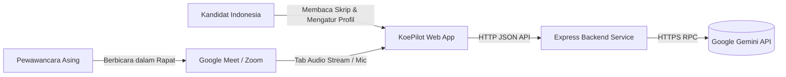
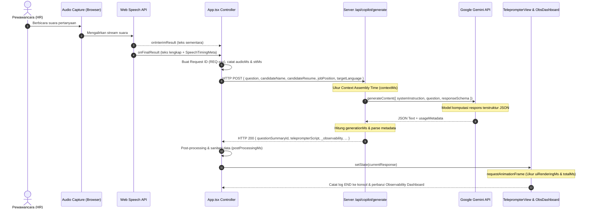

# Technical Architecture Document - KoePilot

## 1. System Context

KoePilot beroperasi sebagai aplikasi web asistif *real-time* yang berjalan berdampingan dengan panggilan video wawancara kerja (seperti Google Meet, Zoom, atau Microsoft Teams).



* **Interaksi Kandidat**: 
  - Membuka KoePilot di layar yang sama atau jendela berdampingan dengan aplikasi wawancara.
  - Memilih profil pekerjaan, ringkasan CV, dan target bahasa (Jepang / UK English).
  - Mengaktifkan pendengaran audio tab atau mikrofon.
  - Membaca skrip teleprompter ber-jeda nafas saat pertanyaan HR selesai diajukan.
* **Interaksi Audio Pewawancara (HR)**:
  - Suara pewawancara masuk ke browser kandidat melalui stream audio tab rapat virtual (`getDisplayMedia`) atau mikrofon laptop (`getUserMedia`).

---

## 2. Component Architecture

Berikut rincian komponen arsitektur aktual yang terimplementasi dalam sistem:

```mermaid
graph TB
    subgraph Client Layer
        UI_Nav[Navbar & Profile Customizer]
        UI_Prompt[TeleprompterView]
        UI_Obs[ObservabilityDashboard]
        UI_Sim[MockInterviewStudio]
        UI_Cam[WebcamMirror]
        
        AudioCap[Audio Capture Controller]
        AudioProc[Web Audio Level Meter]
        STT_Client[Web Speech Recognition Wrapper]
        PipeCtrl[Pipeline Orchestrator - App.tsx]
    end

    subgraph Backend Layer [Express Server - Node.js]
        Route_Gen[/api/copilot/generate]
        Route_Trans[/api/copilot/transcribe]
        Route_Health[/api/health]
        
        ContextEng[Context Engine & Prompt Builder]
        SchemaVal[JSON Schema Validator]
        ModelFallback[Model Fallback Handler]
    end

    subgraph External Services
        GeminiService[(Google Gemini API - @google/genai)]
    end

    AudioCap --> AudioProc
    AudioCap --> STT_Client
    STT_Client --> PipeCtrl
    UI_Sim --> PipeCtrl
    
    PipeCtrl --> Route_Gen
    Route_Gen --> ContextEng
    ContextEng --> ModelFallback
    ModelFallback --> GeminiService
    GeminiService --> SchemaVal
    SchemaVal --> Route_Gen
    
    Route_Gen --> PipeCtrl
    PipeCtrl --> UI_Prompt
    PipeCtrl --> UI_Obs
```

### Rincian Komponen Aktual:
1. **UI Layer (`src/components/`)**:
   - `TeleprompterView.tsx`: Menampilkan naskah teleprompter berformat jeda nafas (`/`), teks asli (Kanji/Kana), terjemahan Bahasa Indonesia, estimasi waktu membaca, dan intisari pertanyaan.
   - `ObservabilityDashboard.tsx`: Panel observabilitas yang memvisualisasikan latensi per tahapan, status eksekusi, penggunaan token, dan tabel 10 riwayat request terakhir.
   - `MockInterviewStudio.tsx`: Simulator pertanyaan audio/teks bawaan dengan koleksi pertanyaan standar wawancara kerja Jepang dan UK.
   - `WebcamMirror.tsx`: Cermin posisi wajah (*head alignment & eye level*) untuk membantu kandidat mempertahankan kontak mata dengan kamera saat membaca.
   - `ProfileDrawer.tsx`: Antarmuka pengeditan nama, resume pengalaman, dan deskripsi lowongan kerja.
   - `AudioCaptureModal.tsx`: Dialog panduan teknis pemilihan sumber audio (Tab Meet vs Mikrofon).
2. **Audio Capture & Processing Layer (`src/utils/speech.ts`)**:
   - `createAudioLevelMeter`: Memanfaatkan `AudioContext` dan `AnalyserNode` native browser untuk menghitung sinyal volume RMS (*Root Mean Square*) secara real-time.
   - `createSpeechRecognizer`: Menginisialisasi `webkitSpeechRecognition` / `SpeechRecognition` dengan konfigurasi bahasa dinamis (`ja-JP` atau `en-GB`), mendeteksi *interim transcript*, dan menghitung durasi segmen audio.
3. **Pipeline Orchestrator (`src/App.tsx`)**:
   - Mengontrol siklus status (`idle` → `listening` → `thinking` → `ready` / `error`).
   - Melakukan instrumentasi waktu presisi tinggi (*high-resolution timing*) dengan `performance.now()`.
   - Mengatur korelasi Request ID (`REQ-xxx`) dan mencetak log terstruktur ke browser console.
4. **Backend Layer (`server.ts`)**:
   - Framework: Express.js berjalan pada port 3000.
   - Endpoint `/api/health`: Health check untuk container monitoring.
   - Endpoint `/api/copilot/generate`: Endpoint utama penerima pertanyaan dan konteks kandidat, merakit system instruction, memanggil Gemini API, memvalidasi JSON schema, dan menghitung durasi komputasi server.
   - Endpoint `/api/copilot/transcribe`: Endpoint pengenalan audio rekaman berbasis model multimodal Gemini (`audio/webm` → teks).
5. **External Services**:
   - Google Gemini API (`@google/genai` TypeScript SDK): Model `gemini-3.8-flash` dengan konfigurasi `thinkingLevel: LOW` dan fallback loop otomatis ke `gemini-3.1-flash-lite` dan `gemini-flash-latest`.

---

## 3. Data Flow

Diagram alur perjalanan data dari suara pewawancara hingga teks tertampil di layar:



---

## 4. Request Lifecycle

Setiap satu siklus pertanyaan melalui tahapan state machine berikut:

1. **State `IDLE` / `LISTENING`**:
   - Stream audio aktif mendengarkan. Indikator level audio berfluktuasi sesuai sinyal suara.
   - Transkrip sementara (*interim transcript*) diperbarui secara real-time di layar.
2. **State Transition `PROCESSING`**:
   - Web Speech API mendeteksi jeda akhir ucapan dan mengembalikan transkrip final.
   - Timer `performance.now()` menandai dimulainya siklus request.
   - Request ID unik dibangkitkan (misal: `REQ-001`).
3. **State Transition `GENERATING`**:
   - Klien mengirim payload HTTP POST ke `/api/copilot/generate`.
   - Di server:
     - Konteks profil digabungkan dengan instruksi terstruktur STAR.
     - Model AI dipanggil dengan skema JSON strict.
     - Jika model primer mengalami kendala atau rate limit, fallback handler secara transparan mencoba model cadangan berikutnya.
4. **State Transition `READY`**:
   - Klien menerima respons terstruktur.
   - Script teleprompter diproses untuk tata letak visual jeda nafas (`/`).
   - Callback `requestAnimationFrame` memastikan waktu render visual ke layar dihitung secara akurat.
   - Rekaman observabilitas baru dibuat dan disimpan ke riwayat sesi.
5. **State Transition `ERROR` (jika terjadi kegagalan)**:
   - Terjadi jika audio terputus, API key tidak valid, model gagal merespons, atau jaringan putus.
   - Alert visual ditampilkan di UI, metrik error di-record, dan status pipeline beralih ke `ERROR`.

---

## 5. Latency Model

Model latensi end-to-end (E2E) pada sistem dihitung dengan rumus:

$$\text{E2E Latency} = T_{\text{AudioProcessing}} + T_{\text{STT}} + T_{\text{Context}} + T_{\text{Generation}} + T_{\text{PostProcessing}} + T_{\text{UIRendering}}$$

### Definisi dan Titik Pengukuran Masing-Masing Tahap:
* $T_{\text{AudioProcessing}}$: Durasi deteksi buffer awal suara hingga *speech start* terdeteksi di browser (`audioStartTime` ke `speechStartTime`).
* $T_{\text{STT}}$: Durasi pengenalan ucapan dari awal suara hingga teks final diterima dari SpeechRecognition event (`now` - `speechStartTime`).
* $T_{\text{Context}}$: Durasi pembentukan prompt dan penggabungan metadata profil kandidat di server (`Date.now()` delta sebelum panggilan API).
* $T_{\text{Generation}}$: Waktu round-trip pemanggilan model Gemini hingga teks JSON diterima (`Date.now()` delta saat memanggil SDK `generateContent`).
* $T_{\text{PostProcessing}}$: Waktu parsing objek, pemetaan array panduan fonetik, dan sanitasi payload di sisi klien.
* $T_{\text{UIRendering}}$: Waktu sejak state React diperbarui hingga browser selesai mengeksekusi paint frame berikutnya (diukur via `requestAnimationFrame`).

---

## 6. Failure Points Analysis

| Titik Potensi Kegagalan | Komponen Terkait | Status Penanganan | Mekanisme Penanganan Aktual di Codebase |
| :--- | :--- | :--- | :--- |
| **Izin Mikrofon / Tab Ditolak** | Browser MediaDevices API | **Handled** | Ditangkap via `catch` block pada `handleRequestMicAudio` dan `handleRequestDisplayAudio`; menampilkan pesan error ramah pengguna di alert banner. |
| **Tab Dipilih Tanpa Ceklis "Share Audio"** | `getDisplayMedia` | **Handled** | Mengecek `stream.getAudioTracks().length === 0`; jika tidak ada audio track, menampilkan peringatan panduan kepada pengguna. |
| **Browser Tidak Mendukung STT** | Web Speech API | **Handled** | `createSpeechRecognizer` mengembalikan `null` jika `window.SpeechRecognition` dan `window.webkitSpeechRecognition` tidak tersedia; UI menampilkan status tidak aktif tanpa *crash*. |
| **Gemini API Key Tidak Ditemukan** | `server.ts` | **Handled** | `getAi()` memeriksa `process.env.GEMINI_API_KEY`; mencetak peringatan ke console server tanpa mematikan proses node saat inisialisasi. |
| **Model Gemini Error / Quota Limit** | `ai.models.generateContent` | **Handled** | Fallback loop otomatis: jika `gemini-3.8-flash` gagal, server mencoba `gemini-3.1-flash-lite`, lalu `gemini-flash-latest`. |
| **JSON Output Rusak dari Model** | Model Parsing | **Handled** | Penggunaan `responseMimeType: "application/json"` dan `responseSchema` strict menjamin output terstruktur valid. |
| **Koneksi Jaringan Client Putus** | Fetch API | **Handled** | Ditangkap oleh `try/catch` di `requestCopilotScript`; status diubah menjadi `ERROR` dan dicatat ke riwayat observabilitas. |
| **Pembatalan Stream Audio Tiba-tiba** | MediaStreamTrack | **Handled** | Event listener `audioTracks[0].onended` otomatis mematikan fungsi *listening* dan mereset status. |
| **Background Noise / Suara Gema** | Web Audio Capture | **Partially implemented** | Diaktifkan opsi native `echoCancellation` & `noiseSuppression` pada mikrofon, namun belum ada filter noise DSP khusus pada tab audio. |
| **Transkripsi Gagal Akibat Aksen Kuat** | Web Speech API | **Not implemented** | `TODO: Verify` integrasi fallback otomatis ke model audio Gemini multimodal jika Web Speech API mengembalikan hasil kosong. |

---

## 7. Security Considerations

1. **Server-Side API Key Isolation**:
   - `GEMINI_API_KEY` disimpan murni di sisi backend (`server.ts` / environment container).
   - Klien browser tidak pernah menerima, membaca, atau menyimpan kunci API ini.
2. **Sanitasi Kredensial & PII (Personally Identifiable Information)**:
   - Metadata observabilitas dan logging konsol **hanya mencatat panjang karakter** (`inputCharacters`, `outputCharacters`) dan metrik token, tidak mencetak isi rahasia dokumen kandidat ke log publik.
3. **Tangkapan Audio Ephemeral**:
   - Stream audio tab rapat dan mikrofon diproses secara *in-memory* di browser klien.
   - Aplikasi tidak merekam atau menyimpan file audio pengguna ke disk/database mana pun.
4. **Transport Security (HTTPS)**:
   - Dalam lingkungan deployment, seluruh komunikasi antar browser dan server diarahkan melalui reverse proxy dengan enkripsi TLS/HTTPS.
5. **Frame Permissions & Sandbox**:
   - File `metadata.json` secara eksplisit hanya meminta izin `microphone` dan `camera` yang diperlukan untuk fungsi teleprompter.
