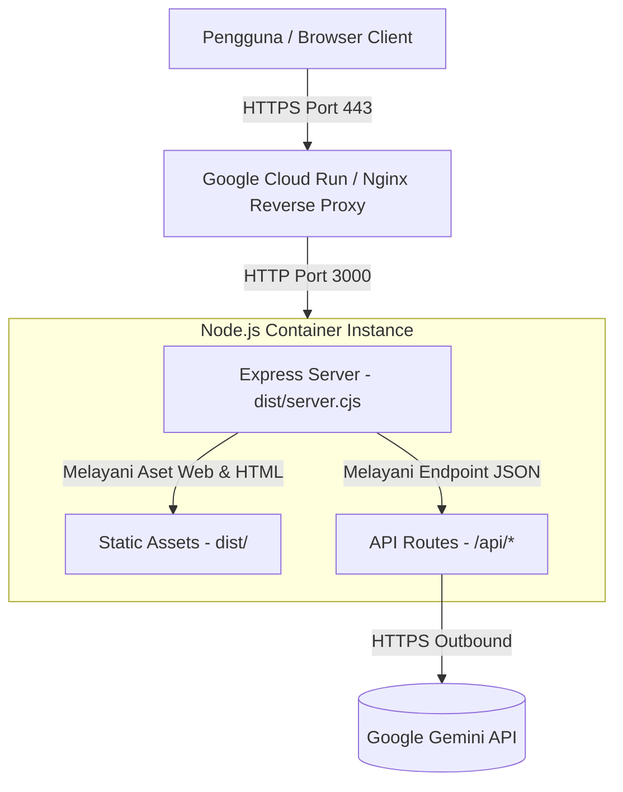

# Deployment Guide - KoePilot

## 1. Prerequisites

Sebelum melakukan deployment, pastikan lingkungan host memenuhi persyaratan berikut:
* **Node.js**: Versi 18.x, 20.x, atau 22.x LTS.
* **Package Manager**: npm (v9+) atau bun.
* **Container Runtime (Opsional untuk Cloud Run/Docker)**: Docker / Cloud Native Buildpacks.
* **Akses Jaringan**: Koneksi keluar (*outbound*) HTTPS ke `generativelanguage.googleapis.com` (port 443).
* **Google Gemini API Key**: Kunci API yang memiliki kuota aktif untuk model `gemini-3.8-flash`.

---

## 2. Environment Variables

Variabel lingkungan berikut wajib dideklarasikan sebelum aplikasi dijalankan:

| Variable | Required | Default | Deskripsi |
| :--- | :--- | :--- | :--- |
| `GEMINI_API_KEY` | **Ya** | `""` | Kunci API Google Gemini untuk pemrosesan AI di sisi server backend. |
| `APP_URL` | Opsional | `""` | URL publik host aplikasi (diinjeksi otomatis oleh platform AI Studio / Cloud Run). |
| `NODE_ENV` | Opsional | `development` | Mode eksekusi aplikasi (`production` atau `development`). |
| `PORT` | Khusus Container | `3000` | Port HTTP yang dibuka oleh container aplikasi (terikat ke `0.0.0.0:3000`). |

> **PERINGATAN KEAMANAN**: Jangan pernah memasukkan nilai API key langsung ke dalam file kode, repositori git, atau file konfigurasi publik. Gunakan secrets manager platform atau file `.env` lokal yang masuk ke dalam `.gitignore`.

---

## 3. Build Process

Aplikasi menggunakan alur kompilasi gabungan untuk aset statis frontend dan server backend:

```bash
# Menjalankan build produksi
NODE_ENV=production npm run build
```

Perintah di atas mengeksekusi dua langkah utama:
1. **Frontend Build (`vite build`)**: Mentranspilasi kode React + TypeScript ke dalam file statis yang dioptimasi dan dikompresi di folder `dist/` (`dist/index.html`, `dist/assets/*.js`, `dist/assets/*.css`).
2. **Backend Bundle (`esbuild server.ts ...`)**: Mengompilasi file `server.ts` menjadi satu berkas CommonJS mandiri `dist/server.cjs` dengan menyertakan sourcemap dan menandai modul eksternal (`--packages=external`).

---

## 4. Run Process

### Mode Development
```bash
npm run dev
```
* Menjalankan server menggunakan `tsx server.ts`.
* Mengaktifkan Vite middleware mode secara otomatis untuk *hot module replacement* dan *on-demand compilation*.

### Mode Production
```bash
# 1. Pastikan build sudah selesai
NODE_ENV=production npm run build

# 2. Jalankan server produksi mandiri
NODE_ENV=production npm start
```
* Script `npm start` mengeksekusi `node dist/server.cjs`.
* Pada mode produksi, server Express secara langsung menyajikan file statis dari direktori `dist/` dan melayani rute SPA fallback ke `dist/index.html`.

---

## 5. Deployment Architecture

Aplikasi dirancang menggunakan arsitektur container monolitik terpadu (*unified container architecture*):



* **Ingress**: Reverse proxy menangani terminasi SSL/TLS dan meneruskan trafik ke port 3000 container.
* **Server**: Satu proses Node.js melayani antarmuka SPA sekaligus endpoint REST API `/api/copilot/generate` dan `/api/health`.

---

## 6. Cloud & External Dependencies

* **Google Cloud Run**: Platform hosting container serverless tempat aplikasi dieksekusi.
* **Google Gemini API**: Layanan model AI eksternal yang dihubungi melalui SDK `@google/genai`.
* **Google Fonts CDN**: Memuat tipografi antarmuka (`Plus Jakarta Sans`, `JetBrains Mono`, `Noto Sans JP`) melalui `index.html`.

---

## 7. Authentication & Security Mechanism

* **User Authentication**: *Not currently implemented* (aplikasi dapat digunakan langsung tanpa login pengguna untuk sesi latihan mandiri).
* **API Authentication**: Backend mengautentikasi setiap panggilan ke Gemini API menggunakan Bearer token atau API Key header yang disuntikkan oleh library `@google/genai` dari variabel lingkungan server `GEMINI_API_KEY`.
* **Client Isolation**: Klien browser tidak memiliki hak akses dan tidak pernah menerima kunci API rahasia.

---

## 8. Development vs Production Configuration

| Karakteristik | Mode Development (`npm run dev`) | Mode Production (`npm start`) |
| :--- | :--- | :--- |
| **Runner** | `tsx server.ts` | `node dist/server.cjs` |
| **Asset Serving** | Vite Middleware (`middlewareMode: true`) | Express Static (`express.static('dist')`) |
| **Source Maps** | Memory source maps Vite | File fisik `dist/server.cjs.map` |
| **Port Binding** | `0.0.0.0:3000` | `0.0.0.0:3000` |
| **Kecepatan Startup** | ~1.5 detik | < 300 milidetik |

---

## 9. Deployment Verification Checklist

Jalankan checklist ini segera setelah revisi baru container berhasil diluncurkan:

- [ ] **Container Startup**: Proses Node.js aktif tanpa throw exception `ERR_INVALID_ARG_TYPE`.
- [ ] **Health Check Endpoint**: Panggilan `curl -s http://localhost:3000/api/health` mengembalikan status `ok`.
- [ ] **Web GUI Rendering**: Halaman depan memuat seluruh font, ikon Lucide, dan komponen utama tanpa error 404 pada file asset.
- [ ] **API Connectivity**: Menguji simulasi pertanyaan di *Mock Interview Studio* dan memastikan respons JSON berhasil diterima.
- [ ] **STT Capability**: Memastikan izin mikrofon dapat diminta dan indikator suara bergerak di browser Chromium.
- [ ] **Observability Active**: Dasbor di atas aplikasi mencatat metrik latensi request pertama.
- [ ] **Secrets Verification**: Memeriksa Network tab di browser developer tools untuk memastikan tidak ada string kunci API yang terpapar pada request/response payload.
- [ ] **Error Handling**: Memastikan server merespons dengan format JSON error yang rapi (bukan HTML stack trace) jika payload request tidak lengkap.
