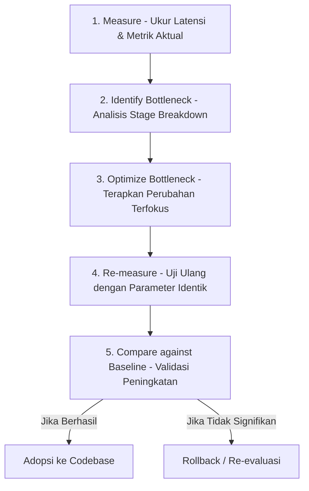

# Performance Engineering Guide - KoePilot

## 1. Current Performance Baseline

* **Production Performance Baseline**: `Baseline not established.` (Pengukuran formal berskala besar di lingkungan produksi multi-wilayah belum difinalisasi).
* **Observasi Awal Lingkungan Development / Sandbox**:
  - Siklus simulasi pada `MockInterviewStudio` menunjukkan total E2E Latency berkisar antara **3,200 ms hingga 5,800 ms**.
  - Distribusi waktu terbesar didominasi oleh pemanggilan LLM (*Generation Stage*), yang berkontribusi sekitar **75% hingga 88%** dari total waktu respons.
  - Tahapan lokal (Context, Post-Processing, dan UI Rendering) secara konsisten berada di bawah **25 ms** per request.

---

## 2. Latency Breakdown per Stage

Setiap transaksi dikategorikan ke dalam 6 tahapan terpisah:

```text
[Audio Processing]  ~ 50 - 150 ms     (1 - 3%)
[Speech-to-Text]    ~ 200 - 600 ms    (5 - 12%)
[Context Assembly]  ~ 5 - 20 ms       (< 1%)
[LLM Generation]    ~ 2,500 - 4,800 ms (75 - 88%)  <--- Dominant Bottleneck
[Post-Processing]   ~ 2 - 10 ms       (< 1%)
[UI Rendering]      ~ 2 - 20 ms       (< 1%)
────────────────────────────────────────────────────
Total E2E Latency:  ~ 2,800 - 5,600 ms (100%)
```

### Karakteristik Tahapan:
1. **Audio Processing**: Dipengaruhi oleh sample rate audio hardware dan latensi thread Web Audio browser.
2. **Speech-to-Text (STT)**: Bergantung pada kecepatan pemrosesan audio speech engine native browser.
3. **Context Assembly**: Berjalan di memori server Node.js; waktu eksekusi hampir instan (< 25 ms).
4. **LLM Generation**: Waktu jaringan ke Google Gemini Cloud ditambah komputasi penalaran model (*thinking time*). Diatur dengan `thinkingLevel: ThinkingLevel.LOW` untuk model `gemini-3.8-flash` guna menekan latensi serendah mungkin tanpa mengorbankan kepatuhan JSON schema.
5. **Post-Processing**: Berjalan di browser untuk memformat string jeda intonasi; komputasi CPU ringan.
6. **UI Rendering**: Ditangkap via `requestAnimationFrame` untuk memastikan seluruh tree komponen React selesai dicat sebelum waktu final dicatat.

---

## 3. Bottleneck Identification Methodology

Untuk mengidentifikasi bottleneck performa secara objektif:

1. **Rasio Persentase Tahapan (*Percentage of Total*)**:
   - Bandingkan durasi tiap tahap terhadap `totalMs`. Tahap dengan persentase di atas 50% adalah kandidat utama bottleneck.
2. **Throughput Generasi Token (*Tokens per Second*)**:
   - Jika `tokensPerSecond` model < 15 token/detik, bottleneck berada pada sisi komputasi model AI atau kompleksitas prompt/skema JSON.
   - Jika `tokensPerSecond` > 40 token/detik namun `generationMs` tetap tinggi, volume token output yang dihasilkan terlalu panjang.
3. **Analisis Network vs Compute**:
   - Bandingkan `netDuration` (durasi HTTP client-server) dengan `serverGenerationMs` (waktu murni eksekusi AI di server). Selisih besar menandakan latensi jaringan transit antara browser dan server.

---

## 4. Optimization Strategy (Loop Iteratif)

Setiap inisiatif optimasi performa **WAJIB** mengikuti siklus 5 tahap berikut:



1. **Measure**: Jalankan uji dengan 5 variasi pertanyaan standar dan catat data metrik pada Observability Dashboard.
2. **Identify Bottleneck**: Tentukan tahap mana yang menyumbang latensi tertinggi.
3. **Optimize Bottleneck**: Terapkan satu intervensi terukur (misal: penyesuaian parameter thinking, pemendekan prompt, atau kompresi JSON schema).
4. **Re-measure**: Uji kembali menggunakan pertanyaan dan profil kandidat yang persis sama.
5. **Compare against Baseline**: Bandingkan metrik baru terhadap angka sebelum perubahan untuk memastikan perbaikan nyata.

---

## 5. Performance Experiments Log Template

Gunakan tabel ini saat menjalankan eksperimen optimasi:

| Experiment ID | Deskripsi Perubahan | Baseline (E2E / Gen) | Hasil Uji (E2E / Gen) | Keputusan |
| :--- | :--- | :--- | :--- | :--- |
| `EXP-001` | Mengaktifkan `thinkingLevel: LOW` pada `gemini-3.8-flash` | `TODO: Verify` | `TODO: Verify` | Diadopsi di `server.ts` |
| `EXP-002` | Mengganti model primer ke `gemini-3.1-flash-lite` | `TODO: Verify` | `TODO: Verify` | Tersedia sebagai Fallback |
| `EXP-003` | Streaming JSON output via Server-Sent Events | `TODO: Verify` | `TODO: Verify` | `Not currently implemented` |
| `EXP-004` | Optimasi Web Audio buffer frame size | `TODO: Verify` | `TODO: Verify` | `TODO: Verify` |
