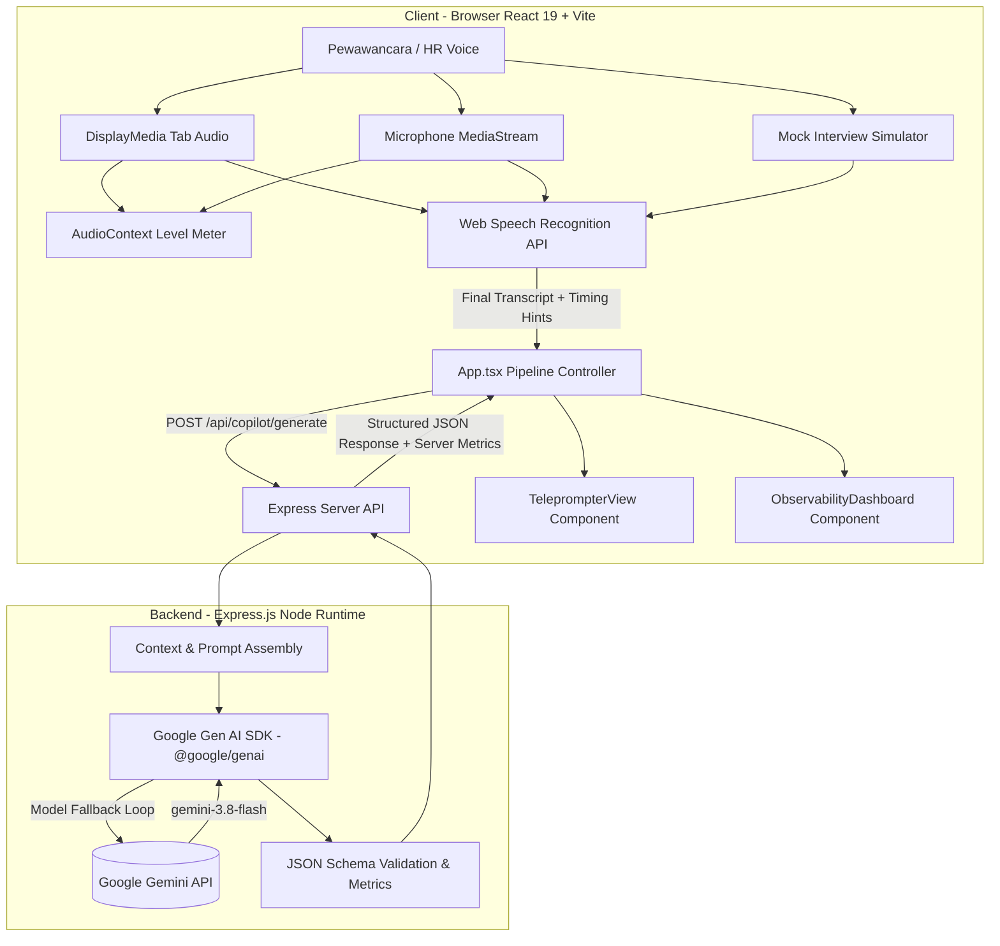

# KoePilot - Real-Time AI Interview Teleprompter & Co-Pilot

## Project Overview

* **Nama Aplikasi**: KoePilot - AI Interview Teleprompter
* **Tujuan Aplikasi**: Menyediakan asisten teleprompter wawancara kerja *real-time* berbasis AI yang dirancang khusus untuk kandidat Indonesia yang menghadapi wawancara kerja dalam bahasa asing (khususnya Bahasa Jepang untuk visa Tokutei Ginou / industri IT dan British English untuk perusahaan multinasional / UK).
* **Problem yang Diselesaikan**: 
  - Kandidat sering mengalami *freezing* (grogi / buntu kata) saat HR asing bertanya secara spontan karena keterbatasan kosakata atau pelafalan.
  - Kesulitan menangkap intisari pertanyaan HR asing yang berbicara cepat dengan aksen lokal.
  - Kurangnya panduan jeda nafas (*breathing pauses*) dan pelafalan fonetik (*phonetic guide*), sehingga kandidat terdengar terbata-bata atau intonasinya tidak wajar.
* **Target User**: Kandidat profesional, pencari kerja, magang (*kaigyo* / *tokutei ginou*), dan engineer asal Indonesia yang melamar ke perusahaan Jepang atau multinational/UK.
* **High-Level Workflow**:
  1. Suara pewawancara (HR) ditangkap secara live (melalui Tab Audio Google Meet/Zoom, Mikrofon, atau Studio Simulasi).
  2. Suara diubah menjadi teks melalui Web Speech Recognition API (STT).
  3. Konteks profil CV kandidat, deskripsi pekerjaan (JD), dan pertanyaan dikirim ke server Express backend.
  4. Backend memanggil Google Gemini API (`gemini-3.8-flash`) dengan instruksi terstruktur untuk menyusun jawaban STAR (Situation, Task, Action, Result).
  5. Jawaban diformat khusus untuk teleprompter: intisari pertanyaan dalam Bahasa Indonesia, Romaji / teks dengan tanda jeda nafas (`/`), panduan fonetik, dan terjemahan per kalimat.
  6. UI merender script teleprompter secara instan bersamaan dengan metrik instrumentasi observabilitas end-to-end.

---

## Core Workflow (Pipeline Aktual)

Pipeline aktual yang berjalan dalam aplikasi terdiri dari 6 tahapan terukur:

```text
Audio HR 
  → Audio Capture & Level Metering (Audio Processing)
  → Speech-to-Text (Web Speech Recognition API)
  → Context Analysis & Prompt Assembly (Server-side)
  → LLM Response Generation (Google Gen AI SDK / Gemini 3.8 Flash)
  → Post-Processing & JSON Parsing (Server & Client formatters)
  → UI Rendering & Teleprompter Display
```

1. **Audio Capture**: Input audio diterima melalui `getDisplayMedia` (audio tab rapat), `getUserMedia` (mikrofon), atau pemicu pertanyaan pada `MockInterviewStudio`.
2. **Audio Processing**: Web Audio API (`AudioContext`, `AnalyserNode`) mengukur level volume secara real-time dan mendeteksi aktivitas sinyal suara.
3. **Speech-to-Text (STT)**: Menggunakan Web Speech API browser (`webkitSpeechRecognition` / `SpeechRecognition`) dengan konfigurasi bahasa `ja-JP` atau `en-GB`. *Catatan*: Tersedia pula endpoint server `/api/copilot/transcribe` menggunakan Gemini multimodal sebagai alternatif pengenalan audio rekaman.
4. **Context Analysis**: Server menyuntikkan profil kandidat (nama, posisi, ringkasan CV, JD) bersama instruksi khusus format Romaji ber-jeda (`/`) dan tone bisnis sopan (Keigo/UK Corporate).
5. **Response Generation**: Server melakukan *batch generation* terstruktur (JSON schema) ke Google Gemini API dengan fallback berurutan (`gemini-3.8-flash` → `gemini-3.1-flash-lite` → `gemini-flash-latest`).
6. **Post-Processing**: Validasi skema respons JSON, estimasi durasi membaca, ekstraksi kata fonetik, dan sanitasi tanda jeda.
7. **UI Rendering**: Komponen React memperbarui DOM teleprompter, diukur presisinya menggunakan `requestAnimationFrame` sebelum finalisasi rekaman observabilitas.

---

## Key Features

1. **Dual Language Support**:
   - **Japanese (日本語)**: Menghasilkan skrip teleprompter berhuruf Romaji dengan pemenggalan jeda nafas (`/`), teks asli Kanji/Kana, Keigo bisnis sopan, dan terjemahan Bahasa Indonesia.
   - **British English (UK)**: Menghasilkan skrip percakapan formal sopan (UK Corporate tone), panduan fonetik kata-kata sulit (aksen British), dan intisari dalam Bahasa Indonesia.
2. **Flexible Audio Source Routing**:
   - **Tab Audio Capture (`getDisplayMedia`)**: Menangkap output audio pewawancara langsung dari tab browser Google Meet, Zoom Web, atau Teams tanpa merekam suara kandidat sendiri.
   - **Microphone Capture (`getUserMedia`)**: Menangkap audio dari mikrofon perangkat atau speaker eksternal.
   - **Mock Interview Studio**: Simulator interaktif bawaan dengan skenario pertanyaan HR standar (Jepang & UK) untuk latihan mandiri tanpa perlu partner wawancara.
3. **Real-Time Teleprompter HUD**:
   - Skrip dengan penanda jeda nafas (`/`) yang jelas untuk intonasi santai dan percaya diri.
   - Poin-poin kunci jawaban (*key takeaways*) untuk mencegah kandidat tampak kaku saat membaca.
   - Cermin webcam opsional (*Webcam Mirror*) untuk membantu melatih kontak mata langsung ke lensa kamera saat membaca skrip.
4. **Candidate Profile & Context Customizer**:
   - Pengaturan nama, posisi lamaran, ringkasan CV, dan deskripsi pekerjaan (JD).
   - Preset profil siap pakai untuk *IT Fullstack Engineer* dan *Caregiver (Kaigo / Tokutei Ginou)*.
5. **Full-Stack Observability Dashboard**:
   - Dasbor telemetri performa sistem di bagian atas aplikasi yang dapat diciutkan (*collapsible*).
   - Menghitung latensi per tahap (*stage breakdown*), metrik token LLM, status request, dan visualisasi bar chart kontribusi latensi.

---

## Architecture



---

## Observability

Aplikasi dilengkapi modul observabilitas terintegrasi pada antarmuka (`ObservabilityDashboard.tsx`) dan logging konsol:

| Metrik / Fitur | Status Implementasi | Sumber & Keterangan |
| :--- | :--- | :--- |
| **End-to-End Latency** | **Implemented** | `performance.now()` dari deteksi suara/input hingga cat DOM selesai (`requestAnimationFrame`). |
| **Stage Latencies** | **Implemented** | Dipecah menjadi 6 tahapan: Audio Processing, STT, Context Assembly, LLM Generation, Post-Processing, UI Rendering. |
| **Latency Visualization** | **Implemented** | Horizontal bar chart dan proportional progress bar di dasbor. |
| **Request ID** | **Implemented** | Format sekuensial terstruktur (e.g. `REQ-001`, `REQ-002`). |
| **Request Metadata** | **Implemented** | Timestamp mulai & selesai (jam:menit:detik.ms), durasi audio, karakter input & output, nama model aktif. |
| **Model Name** | **Implemented** | Nama model aktual yang sukses merespons (`gemini-3.8-flash` atau fallback). |
| **Token Usage** | **Implemented** | `inputTokens`, `outputTokens`, `totalTokens` bersumber dari `usageMetadata` Gemini SDK. |
| **Tokens Per Second** | **Implemented** | Dihitung: `outputTokens / (generationSeconds)`. |
| **Finish Reason** | **Implemented** | Status penyelesaian komputasi (e.g. `STOP`). |
| **Time To First Token (TTFT)** | **N/A** *(Not currently implemented)* | Berisi `null` / `N/A` karena endpoint `/api/copilot/generate` menggunakan mode *non-streaming batch execution*. |
| **Network Timing** | **Implemented** | HTTP status code, request duration, response duration, retry count, error count. |
| **Recent Requests History** | **Implemented** | Menyimpan hingga 10 request terakhir di memori browser dengan opsi *Clear History*. |
| **Structured Console Tracing** | **Implemented** | Log berurutan pada devtools console (`[REQ-ID] START`, `[REQ-ID] STT: ...`, `[REQ-ID] END: ...`). |

---

## Tech Stack

* **Frontend**:
  * React 19 (`react`, `react-dom`)
  * TypeScript
  * Tailwind CSS v4 (`@tailwindcss/vite`, `tailwindcss`)
  * Motion (`motion`) untuk animasi transisi UI
  * Lucide React (`lucide-react`) untuk sistem ikon visual
  * Web Speech API (`SpeechRecognition` / `webkitSpeechRecognition`)
  * Web Audio API (`AudioContext`, `AnalyserNode`)
* **Backend**:
  * Node.js runtime
  * Express.js (`express` v4)
  * Google Gen AI SDK (`@google/genai` v2.4.0)
  * Dotenv (`dotenv`)
* **Build & Tooling**:
  * Vite 8 (`vite`, `@vitejs/plugin-react`)
  * ESBuild (`esbuild`) untuk bundling server CJS mandiri (`dist/server.cjs`)
  * TSX (`tsx`) untuk execution server development TypeScript
* **AI Models**:
  * Primary: `gemini-3.8-flash` (dengan `thinkingLevel: LOW`)
  * Fallbacks: `gemini-3.1-flash-lite`, `gemini-flash-latest`

---

## Project Structure

```text
├── .env.example              # Deklarasi variabel lingkungan yang dibutuhkan
├── .gitignore                # Aturan pengecualian git (node_modules, dist, .env)
├── index.html                # Entry point HTML aplikasi dengan font Google
├── metadata.json             # Metadata manifest aplikasi AI Studio & frame permissions
├── package.json              # Definisi scripts, dependensi, dan metadata npm
├── server.ts                 # Server Express backend, integrasi Gemini AI, dan middleware Vite
├── tsconfig.json             # Konfigurasi kompilator TypeScript
├── vite.config.ts            # Konfigurasi build Vite dan Tailwind CSS
└── src/
    ├── App.tsx               # Komponen root controller, state manager, dan orchestrator pipeline
    ├── main.tsx              # React DOM render entry point
    ├── index.css             # Import styling Tailwind CSS
    ├── types.ts              # Definisi TypeScript interface (Observability, Teleprompter, dsb.)
    ├── components/
    │   ├── AudioCaptureModal.tsx      # Modal petunjuk pemilihan sumber input audio
    │   ├── MockInterviewStudio.tsx    # Panel simulator pertanyaan wawancara (Jepang & UK)
    │   ├── Navbar.tsx                 # Navigasi atas, pemilih bahasa, dan kontrol cermin webcam
    │   ├── ObservabilityDashboard.tsx # Dasbor visual metrik performa & riwayat telemetry
    │   ├── ProfileDrawer.tsx          # Drawer kustomisasi profil kandidat, CV, dan deskripsi kerja
    │   ├── SessionHistory.tsx         # Riwayat jawaban wawancara dalam sesi aktif
    │   ├── TeleprompterView.tsx       # Tampilan utama naskah bacaan, jeda nafas, dan terjemahan
    │   └── WebcamMirror.tsx           # Komponen video webcam untuk latihan kontak mata
    ├── data/
    │   └── presets.ts        # Data profil default kandidat (Software Engineer & Caregiver)
    └── utils/
        └── speech.ts         # Wrapper Web Speech Recognition dan Web Audio Level Meter
```

---

## Local Development

### 1. Prerequisites
- Node.js versi 18+ atau 20+ (rekomendasi LTS)
- NPM atau Bun
- Google Gemini API Key

### 2. Setup Environment
Salin file konfigurasi lingkungan:
```bash
cp .env.example .env
```
Isi nilai `GEMINI_API_KEY` pada file `.env` dengan API key aktif Anda.

### 3. Instalasi Dependensi
```bash
npm install
```

### 4. Menjalankan Development Server
```bash
npm run dev
```
Server akan berjalan di `http://localhost:3000` (atau `http://0.0.0.0:3000`). Buka URL tersebut di browser (disarankan Google Chrome untuk dukungan penuh Web Speech Recognition).

### 5. Validasi Tipe & Build
```bash
# Validasi TypeScript
npm run lint

# Kompilasi Production Build
npm run build
```

---

## Environment Variables

| Variable | Required | Deskripsi |
| :--- | :--- | :--- |
| `GEMINI_API_KEY` | **Ya** (untuk fitur AI) | Kunci API Google Gemini untuk memproses generasi skrip dan transkripsi. Dikelola di sisi server, tidak pernah dipaparkan ke client. |
| `APP_URL` | Opsional | URL publik host aplikasi (diinjeksi otomatis oleh platform Cloud Run / AI Studio). |
| `NODE_ENV` | Opsional | Menentukan mode server (`production` atau `development`). |

---

## Known Limitations

1. **Browser STT Compatibility**: Web Speech Recognition API (`webkitSpeechRecognition`) memiliki dukungan terbaik pada browser berbasis Chromium (Google Chrome, Microsoft Edge). Pada Firefox atau Safari, beberapa fungsi transkripsi suara real-time mungkin tidak tersedia secara native.
2. **Tab Audio Capture Support**: Fitur menangkap audio tab rapat (*share tab audio*) bergantung pada dukungan OS dan browser via `navigator.mediaDevices.getDisplayMedia`. Di beberapa sistem operasi (seperti Linux tertentu), audio sistem tidak dapat dibagikan secara langsung tanpa konfigurasi PulseAudio/PipeWire.
3. **Non-Streaming Endpoint**: Endpoint `/api/copilot/generate` saat ini bersifat *batch* (menghasilkan seluruh JSON sekaligus). Sehingga *Time To First Token* (TTFT) berstatus `N/A`, dan seluruh teks muncul sekaligus setelah model selesai melakukan kalkulasi.
4. **Ephemeral Memory Storage**: Riwayat pertanyaan (`sessionHistory`) dan riwayat observabilitas (`observabilityHistory`) disimpan di state in-memory React (akan tereset saat tab di-refresh).

---

## Future Improvements

1. **Streaming JSON Response (Server-Sent Events / WebSockets)**: Mengimplementasikan respons streaming untuk mengurangi persepsi waktu tunggu kandidat dan mengaktifkan metrik TTFT nyata.
2. **Server-Side Whisper / Gemini Audio Fallback**: Menjadikan endpoint `/api/copilot/transcribe` sebagai fallback otomatis jika browser client tidak mendukung Web Speech API.
3. **Persistent Session Storage**: Menghubungkan riwayat sesi wawancara ke penyimpanan terstruktur (misal Firestore) untuk evaluasi performa kandidat setelah wawancara selesai.
4. **Audio Noise Suppression Engine**: Menambahkan modul filter peredam kebisingan latar belakang sebelum audio diteruskan ke mesin pengenalan suara.
