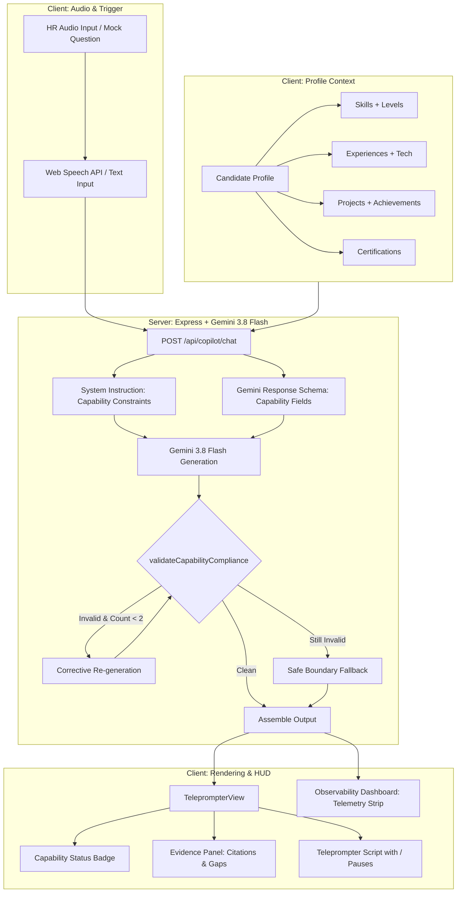

# Candidate Capability Boundary — Anti-Fabrication Guard
## Technical Documentation & Architectural Reference

---

## 1. Overview

**Candidate Capability Boundary (Anti-Fabrication Guard)** is a core architectural subsystem within **KoePilot — Real-Time AI Interview Teleprompter & Co-Pilot**. Its primary mission is to prevent generative AI hallucinations and ungrounded career claims during live job interview assistance.

### Core Principle
> **KoePilot should help candidates articulate their actual capabilities and experience rather than manufacture professional experience they do not have.**

### Purpose & Relationship to KoePilot
In a high-stakes job interview, candidates using AI assistance risk being disqualified or exposed if the LLM embellishes answers by claiming unperformed projects, fabricated metrics, or unfamiliar technology stacks. KoePilot integrates this feature directly into its request pipeline:
1. The candidate explicitly declares structured capabilities in their profile (skills, experiences, projects, certifications).
2. The server feeds these declared items as the strict **Evidence Source of Truth** into Gemini (`gemini-3.8-flash`).
3. Gemini evaluates the question against the evidence to classify status (`SUPPORTED`, `PARTIALLY_SUPPORTED`, or `UNSUPPORTED`).
4. An automated server-side compliance validator inspects the draft answer before returning it to the client, triggering self-correcting regeneration or safe fallback if ungrounded metrics or technology claims are detected.
5. The frontend teleprompter renders an explicit status badge, an expandable **Evidence Panel**, and telemetry metrics in the observability dashboard.

> **Crucial Boundary Note**: This feature constrains AI generation based on **candidate-declared evidence**. It guarantees that the AI will not manufacture claims beyond what the candidate entered. It does **not** prove or verify whether the candidate's declared profile is truthful in the real world (which requires external background checks or objective testing).

---

## 2. Problem Statement

Standard generative AI assistants (e.g., generic ChatGPT or Claude prompts) are optimized for helpfulness and persuasiveness. When prompted with a job interview question such as:
> *"Tell me about your hands-on experience orchestrating Kubernetes clusters in production."*

a generic LLM typically responds in the first person with an impressive, detailed narrative describing production Kubernetes cluster management, Helm rollouts, and zero-downtime blue-green deployments—even if the candidate has only worked with basic Docker on a single virtual machine.

### Failure Modes of Unconstrained AI in Interviews
* **Invented Technologies**: Claiming proficiency in tools never encountered (e.g., Kubernetes, AWS Lambda, Kafka, GraphQL).
* **Invented Metrics & Benchmarks**: Fabricating statistical claims (e.g., *"improved query latency by 45%"* or *"achieved 99.99% uptime"*).
* **Invented Leadership & Team Sizes**: Manufacturing management experience (e.g., *"led a team of 8 engineers and conducted annual performance reviews"* when the candidate was an individual junior contributor).
* **Invented Production Scale**: Exaggerating transaction volumes, cluster sizes, or multi-region high availability.
* **Invented Employers & Projects**: Referencing fictitious initiatives or enterprise clients.
* **Invented Certifications**: Citing credentials not held by the candidate.

### The Interview Capability Mismatch
```text
┌─────────────────────────────────────────────────────────────┐
│  AI-Generated Interview Performance (Flawless / Senior)    │
└──────────────────────────────┬──────────────────────────────┘
                               │
                       [Critical Mismatch]
                               │
┌──────────────────────────────▼──────────────────────────────┐
│  Candidate's Actual Capability (Intermediate / Foundation)  │
└─────────────────────────────────────────────────────────────┘
```
When follow-up technical questions probe deep operational nuances, the candidate is unable to defend the fabricated claims, resulting in immediate loss of credibility and disqualification. KoePilot resolves this by restricting generated answers strictly to candidate-declared evidence.

---

## 3. Product Principle

The system enforces a deterministic progression from declared evidence to teleprompter output:

```text
Candidate Declared Evidence
        ↓
Capability Analysis & Relevance Matching
        ↓
Explicit Capability Boundary Constraints
        ↓
Constrained Answer Generation (Gemini 3.8 Flash)
        ↓
Post-Generation Claim Validation Guard
        ↓
Self-Correcting Regeneration / Safe Fallback
        ↓
Grounded, Honest Teleprompter Script
```

### Permitted vs. Prohibited Operations
* **Permitted Operations**:
  * Structuring real stories into the STAR framework (Situation, Task, Action, Result).
  * Rephrasing candidate experiences into polished, professional business language (Keigo for Japanese, UK Corporate Tone for British English).
  * Adding phonetic pronunciation guidance and breath-pause marks (`/`) for smooth vocal delivery.
  * Connecting closely related declared skills (e.g., using Docker containerization concepts to explain general infrastructure readiness).
  * Framing lack of experience with professional honesty, curiosity, and rapid-learning methodologies.
* **Prohibited Operations**:
  * Manufacturing technologies, frameworks, or cloud providers absent from the declared profile.
  * Fabricating quantitative metrics, percentages, or benchmarks not present in profile evidence.
  * Claiming managerial authority or team sizes not stated by the candidate.
  * Assuming enterprise production deployment experience when only development usage was declared.

---

## 4. Capability Data Model

The feature is typed in `src/types.ts` through dedicated interfaces:

```typescript
// src/types.ts

export type CapabilityStatus = 'SUPPORTED' | 'PARTIALLY_SUPPORTED' | 'UNSUPPORTED';

export interface CandidateSkill {
  name: string;
  level?: 'beginner' | 'intermediate' | 'advanced' | 'expert';
  description?: string;
}

export interface CandidateExperience {
  title: string;
  organization?: string;
  description: string;
  technologies?: string[];
}

export interface CandidateProject {
  name: string;
  description: string;
  technologies?: string[];
  responsibilities?: string[];
  achievements?: string[];
}

export interface CandidateCertification {
  name: string;
  issuer?: string;
  year?: string;
}

export interface CandidateCapabilityProfile {
  skills: CandidateSkill[];
  experiences: CandidateExperience[];
  projects: CandidateProject[];
  certifications: CandidateCertification[];
}

export interface CapabilityAnalysis {
  capabilityStatus: CapabilityStatus;
  relevantCapabilities: string[];
  missingCapabilities: string[];
  evidenceUsed: string[];
  riskNote: string | null;
}
```

### Field Breakdown
* **`CandidateSkill`**:
  * `name`: Name of the skill (e.g., `React`, `Docker`, `Japanese N3`).
  * `level`: Declared mastery level (`beginner`, `intermediate`, `advanced`, `expert`).
  * `description`: Optional context on how the skill was utilized.
* **`CandidateExperience`**:
  * `title`: Job title held (e.g., `Junior Frontend Developer`).
  * `organization`: Employer or institution name.
  * `description`: Concise summary of responsibilities and scope.
  * `technologies`: Array of specific technical tools used on the job.
* **`CandidateProject`**:
  * `name`: Project title (e.g., `Point-of-Sale Optimization`).
  * `description`: Functional summary of the application or initiative.
  * `technologies`: Tech stack employed.
  * `responsibilities`: Specific modules or tasks owned by the candidate.
  * `achievements`: Concrete, candidate-verified results (e.g., *"Optimized FCP from 2.8s to 1.1s"*).
* **`CandidateCertification`**:
  * `name`: Official certificate name (e.g., `JLPT N3`, `AWS Certified Solutions Architect`).
  * `issuer`: Issuing body (e.g., `Japan Foundation`, `Amazon Web Services`).
  * `year`: Year obtained.

These collections are bundled into `CandidateProfile.capabilities?: CandidateCapabilityProfile`.

---

## 5. Capability Status

KoePilot classifies every interview question into one of three statuses:

```text
┌────────────────────────┬────────────────────────────────────────────────────────┐
│ Status                 │ Semantic Meaning & Behavior                            │
├────────────────────────┼────────────────────────────────────────────────────────┤
│ 🟢 SUPPORTED           │ Direct evidence exists in the candidate's profile.      │
│                        │ Full STAR response generated using real experience.    │
├────────────────────────┼────────────────────────────────────────────────────────┤
│ 🟡 PARTIALLY_SUPPORTED │ Related foundation exists, but the exact tool/scope    │
│                        │ requested is missing. Script acknowledges the gap and   │
│                        │ pivots to relevant declared skills.                     │
├────────────────────────┼────────────────────────────────────────────────────────┤
│ 🔴 UNSUPPORTED         │ No relevant evidence exists in the profile. Script     │
│                        │ acknowledges limitation with humility, cites core      │
│                        │ strengths, and highlights rapid learning capability.   │
└────────────────────────┴────────────────────────────────────────────────────────┘
```

### Concrete Examples from Presets
* **`SUPPORTED`**: Candidate Budi Santoso (Frontend Engineer) is asked:
  > *"How have you used React and TypeScript to optimize web performance?"*
  * **Evidence**: Budi declared React 18, TypeScript, and project achievements reducing FCP from 2.8s to 1.1s.
  * **Outcome**: Gemini generates a direct, evidence-backed STAR response.
* **`PARTIALLY_SUPPORTED`**: Candidate Budi Santoso is asked:
  > *"How have you deployed and orchestrated production applications using Kubernetes?"*
  * **Evidence**: Budi declared `Docker` containerization, but has **no** Kubernetes cluster experience.
  * **Outcome**: Script acknowledges no direct production Kubernetes experience, then pivots to Docker containerization workflow.
* **`UNSUPPORTED`**: Candidate Budi Santoso is asked:
  > *"Tell me about your hands-on production experience with AWS Lambda serverless architectures."*
  * **Evidence**: Budi's declared profile is strictly client-side frontend and Node.js; no AWS serverless experience is listed.
  * **Outcome**: Script explicitly acknowledges that serverless Lambda is outside current production experience, mentions familiarity with REST APIs, and expresses interest in event-driven models.

---

## 6. Capability Analysis Flow

In the current implementation, capability analysis is performed server-side inside `server.ts`. Rather than invoking a separate, slow preliminary LLM call, KoePilot injects the candidate's structured capability profile into the primary Gemini system instruction and schema:

```text
HR Voice / Interview Question
                │
                ▼
Client Audio Pipeline / Mock Studio
                │
                ▼ (HTTP POST /api/copilot/chat)
Server: Assemble Evidence & Inject System Constraints
                │
                ├─► [CANDIDATE SKILLS]
                ├─► [CANDIDATE EXPERIENCE]
                ├─► [CANDIDATE PROJECTS]
                └─► [CANDIDATE CERTIFICATIONS]
                │
                ▼
Gemini 3.8 Flash (Structured JSON Schema Enforcement)
                │
                ├─► Capability Analysis (Evaluates question vs profile)
                ├─► Status Assignment (SUPPORTED | PARTIALLY_SUPPORTED | UNSUPPORTED)
                ├─► Evidence Selection (relevantCapabilities, evidenceUsed)
                ├─► Gap Identification (missingCapabilities)
                └─► Answer Script Formulation (teleprompterScript with / pauses)
                │
                ▼
Post-Generation Compliance Guard (validateCapabilityCompliance)
                │
         ┌──────┴──────┐
      [Valid]      [Invalid]
         │             │
         │             ▼
         │      Trigger Re-generation with corrective feedback (up to 2 attempts)
         │             │
         │      ┌──────┴──────┐
         │   [Valid]      [Still Invalid]
         │      │             │
         │      │             ▼
         │      │       Apply Safe Boundary Fallback
         ▼      ▼             ▼
Assemble Observability & Return JSON to Client
```

---

## 7. Gemini Prompt Constraints

Inside `server.ts`, the `systemInstruction` contains a dedicated constraint block titled `CANDIDATE CAPABILITY CONSTRAINTS`:

```text
================================================================================
CANDIDATE CAPABILITY CONSTRAINTS (STRICT & ABSOLUTE PRODUCT PRINCIPLE):
KoePilot membantu kandidat mengomunikasikan pengalaman nyata mereka.
KoePilot DILARANG MENGARANG (MANUFACTURE/FABRICATE) pengalaman yang tidak dimiliki kandidat!

AI DILARANG KERAS mengarang, mengasumsikan, mengekstrapolasi, atau mengklaim hal-hal berikut jika TIDAK ada bukti di profil kandidat di bawah:
1. Keterampilan / Teknologi (Skills / Technologies)
2. Perusahaan / Pemberi kerja (Employers / Organizations)
3. Proyek nyata (Projects)
4. Tanggung jawab pekerjaan (Responsibilities)
5. Pencapaian atau Metrik terukur (Achievements, metrics, percentages like "improved by 25%", benchmarks)
6. Sertifikasi resmi (Certifications)
7. Tahun pengalaman / Lama kerja (Years of experience)
8. Pengalaman kepemimpinan / Manajerial / Ukuran tim (Leadership, team size like "led a team of 5 engineers")
9. Pengalaman deployment skala produksi (Production deployment, cluster scale)
10. Hasil bisnis (Business results)
```

### Grounding Rule
The prompt strictly establishes that:
> *A technology or skill keyword appearing in a skill list does not automatically prove enterprise production deployment or team leadership unless explicit supporting evidence is documented in the profile's experiences or projects.*

---

## 8. Structured Gemini Response

Gemini is constrained using `responseMimeType: "application/json"` and a strict `responseSchema` (`Type.OBJECT`) defined in `server.ts`:

### Capability Metadata Properties in Schema
```typescript
responseSchema = {
  type: Type.OBJECT,
  properties: {
    capabilityStatus: {
      type: Type.STRING,
      enum: ["SUPPORTED", "PARTIALLY_SUPPORTED", "UNSUPPORTED"],
      description: "Status kesesuaian kapabilitas kandidat terhadap pertanyaan HR",
    },
    relevantCapabilities: {
      type: Type.ARRAY,
      items: { type: Type.STRING },
      description: "Daftar keterampilan atau bukti dari profil yang digunakan dalam jawaban",
    },
    missingCapabilities: {
      type: Type.ARRAY,
      items: { type: Type.STRING },
      description: "Keterampilan atau alat yang ditanyakan HR namun belum ada di profil kandidat",
    },
    evidenceUsed: {
      type: Type.ARRAY,
      items: { type: Type.STRING },
      description: "Kutipan bukti konkret dari pengalaman/proyek/sertifikasi kandidat yang dipakai",
    },
    riskNote: {
      type: Type.STRING,
      description: "Penjelasan batas kapabilitas, catatan kejujuran, atau pivot yang dilakukan",
    },
    questionSummaryId: { type: Type.STRING },
    questionOriginal: { type: Type.STRING },
    teleprompterScript: { type: Type.STRING },
    nativeScript: { type: Type.STRING },
    pronunciationGuide: { /* ... */ },
    indonesianTranslation: { type: Type.STRING },
    keyTakeaways: { type: Type.ARRAY, items: { type: Type.STRING } },
    estimatedReadTimeSec: { type: Type.INTEGER },
  },
  required: [
    "capabilityStatus",
    "questionSummaryId",
    "teleprompterScript",
    "indonesianTranslation",
    "keyTakeaways",
  ],
};
```

### Example Structured Output
```json
{
  "capabilityStatus": "PARTIALLY_SUPPORTED",
  "relevantCapabilities": [
    "Docker (intermediate container management)",
    "CI/CD with GitHub Actions"
  ],
  "missingCapabilities": [
    "Kubernetes production cluster orchestration"
  ],
  "evidenceUsed": [
    "Containerized Next.js & Express apps with multi-stage Dockerfiles"
  ],
  "riskNote": "Kandidat memiliki fondasi Docker containerization tetapi belum pernah mengelola Kubernetes EKS di produksi. Jawaban dengan jujur mengakui batasan dan melakukan pivot.",
  "questionSummaryId": "Pengalaman melakukan orkestrasi aplikasi menggunakan Kubernetes di produksi.",
  "questionOriginal": "How have you deployed and orchestrated production applications using Kubernetes?",
  "teleprompterScript": "Certainly. / In my previous projects, / I have focused primarily on Docker containerization / for building reproducible environments. / While I have not managed production Kubernetes clusters directly, / I understand container lifecycle concepts / and I am keen to expand my skills / into Kubernetes orchestration.",
  "nativeScript": "Certainly. In my previous projects, I have focused primarily on Docker containerization for building reproducible environments...",
  "indonesianTranslation": "Tentu saja. Pada proyek sebelumnya, saya berfokus pada kontainerisasi Docker untuk membuat lingkungan yang konsisten. Meskipun saya belum mengelola kluster Kubernetes produksi secara langsung, saya memahami konsep siklus hidup kontainer dan sangat antusias mempelajari orkestrasi Kubernetes.",
  "keyTakeaways": [
    "Akui belum ada pengalaman langsung Kubernetes produksi",
    "Jelaskan pengalaman nyata dengan Docker container",
    "Tunjukkan pemahaman konsep dan antusiasme belajar"
  ],
  "estimatedReadTimeSec": 22
}
```

---

## 9. Unsupported Claim Guard

The server executes a dedicated post-generation validation function, `validateCapabilityCompliance(parsed)`, immediately after receiving the parsed JSON from Gemini.

```text
┌─────────────────────────────────────────────────────────┐
│               Gemini Response Parsed                    │
└────────────────────────────┬────────────────────────────┘
                             │
                             ▼
              validateCapabilityCompliance()
                             │
       ┌─────────────────────┴─────────────────────┐
       ▼                                           ▼
[Check 1: Percentage Metrics]          [Check 2: Unlisted Tech]
Regex: /\b\d{1,3}%\b/g                 Matches unlisted keywords:
Compares numbers against raw           e.g. AWS Lambda, Kubernetes,
profile text. If not found:            Kafka, Go, Rust. If marked
Flag as fabricated metric.             SUPPORTED: Flag as mismatch.
       │                                           │
       └─────────────────────┬─────────────────────┘
                             │
                     Issues detected?
                      /            \
                   [YES]           [NO]
                    /                \
      regenerationCount < 2?          Return Clean Response
          /            \
       [YES]           [NO]
        /                \
Trigger corrective    Enforce Safe Fallback
Gemini re-generation  (Downgrade to PARTIALLY_SUPPORTED
                      & append Risk Note)
```

### Validation Checks Performed
1. **Fabricated Percentage Metrics**:
   * Scans `teleprompterScript` and `nativeScript` using `/\b\d{1,3}%\b/g`.
   * Checks if each detected percentage string (e.g., `25%`, `40%`) exists in the candidate's raw profile text (`skills`, `experiences`, `projects`, `resumeSummary`).
   * If a percentage appears in the answer that was never declared by the candidate, it is flagged:
     `"Fabricated metric detected: '25%' is not declared in candidate profile"`.
2. **Unsupported Technology Claims**:
   * Scans the question for high-profile specialized keywords (`aws lambda`, `kubernetes`, `k8s`, `kafka`, `graphql`, `golang`, `rust`, `flutter`).
   * If the question requests one of these tools and it is absent from the candidate's profile, but Gemini marked `capabilityStatus: "SUPPORTED"`, it is flagged:
     `"Unsupported claim: Question asks about '<tech>' which is not in candidate profile, but status was marked SUPPORTED"`.

### Re-generation Flow
When validation fails and `regenerationCount < 2`:
1. `unsupportedClaimDetected` flag is set to `true`.
2. `regenerationCount` is incremented.
3. A corrective prompt is constructed:
   ```text
   PERINGATAN VALIDASI: Draf jawaban sebelumnya melanggar batas kapabilitas kandidat:
   [Daftar issues yang terdeteksi]

   Silakan susun ulang jawaban dengan jujur!
   - Jika kandidat tidak memiliki teknologi/metrik tersebut, set capabilityStatus ke "PARTIALLY_SUPPORTED" atau "UNSUPPORTED".
   - Akui keterbatasan secara jujur, JANGAN sebutkan metrik atau skill yang tidak tercantum di profil!
   - Sediakan teleprompterScript yang aman dan jujur.
   ```
4. Gemini is called a second time. If the second response passes, it is used. If it still contains issues, the system applies the **Safe Fallback**.

---

## 10. Safe Fallback

If both generation attempts fail to produce a strictly compliant answer, KoePilot executes a defensive fallback modification rather than returning a fabricated script or crashing the application:

```typescript
// server.ts fallback logic
unsupportedClaimDetected = true;
parsed.capabilityStatus = parsed.capabilityStatus === 'SUPPORTED' ? 'PARTIALLY_SUPPORTED' : parsed.capabilityStatus;
parsed.riskNote = `[Safe Boundary Guard] ${secondValidation.issues[0] || 'Jawaban disesuaikan agar tidak mengarang pengalaman yang tidak ada.'}`;
```

### Safe Fallback Tone & Strategy
When a capability gap is present, the fallback response enforces 5 guidelines:
1. **Directly Acknowledge Limitation**: State clearly that the specific technology has not been used in production.
2. **Avoid Manufacturing Experience**: Mention no fabricated dates, employers, or performance gains.
3. **Bridge to Adjacent Foundations**: Pivot to declared tools (e.g., Docker for container questions, REST APIs for cloud service questions).
4. **Professional Communication**: Use polite, calm phrasing suited for interviewers.
5. **Preserve Language Formatting**: Maintain Romaji with `/` pauses for Japanese, or UK Corporate phrasing for British English.

---

## 11. Candidate Profile UI

Profile management is implemented in `src/components/ProfileDrawer.tsx`. It provides dedicated inputs for declared evidence:

```text
┌─────────────────────────────────────────────────────────────┐
│ 👤 Konteks Profil & CV Kandidat                             │
├─────────────────────────────────────────────────────────────┤
│ • Preset Quick Select: [Fullstack IT] [Kaigo Caregiver]     │
│ • Candidate Name, Target Language, Position, Resume, JD     │
├─────────────────────────────────────────────────────────────┤
│ 🛡️ Batasan Kapabilitas Kandidat (Declared Evidence)         │
│   [Anti-Fabrication Guard: Evidence Source of Truth]        │
│                                                             │
│   1. 🎯 Keterampilan Terdeklarasi (Declared Skills)        │
│      [Pill tags with level: Beginner/Interm/Adv/Expert]     │
│      [+ Tambah Skill Form]                                  │
│                                                             │
│   2. 💼 Riwayat Pekerjaan (Work Experiences)               │
│      [Cards showing Title, Organization, Tech Stack, Desc]  │
│      [+ Tambah Pengalaman Form]                             │
│                                                             │
│   3. 🚀 Proyek Nyata (Real Projects)                       │
│      [Cards showing Project Name, Desc, Key Achievements]   │
│      [+ Tambah Proyek Form]                                 │
│                                                             │
│   4. 📜 Sertifikasi Resmi (Official Certifications)        │
│      [Cert Name, Issuer, Year]                              │
│      [+ Tambah Sertifikasi Form]                            │
└─────────────────────────────────────────────────────────────┘
```

### Distinction of Authority
```text
Candidate-Declared Evidence (Profile Input)
                    ≠
Objectively Verified Competence (Real-world testing / background checks)
```
The UI explicitly notes: *"KoePilot hanya akan menghasilkan jawaban berdasarkan keterampilan, pengalaman, dan bukti nyata yang Anda deklarasikan di bawah ini. AI dilarang mengarang teknologi atau metrik di luar bukti ini."*

---

## 12. Teleprompter UI

The live teleprompter interface in `src/components/TeleprompterView.tsx` exposes the capability evaluation directly above the reading script:

### Status Indicator Badges
* 🟢 **`SUPPORTED (Didukung Bukti)`**: Emerald container (`bg-emerald-950/20 border-emerald-500/30`).
  * Informs the candidate: *"KoePilot memastikan jawaban sepenuhnya bertumpu pada keahlian, teknologi, dan riwayat yang Anda deklarasikan tanpa karangan metrik."*
* 🟡 **`PARTIALLY_SUPPORTED (Pivot Jujur)`**: Amber container (`bg-amber-950/20 border-amber-500/30`).
  * Informs the candidate: *"Pertanyaan menyinggung teknologi/alat yang belum terdaftar di profil. AI secara jujur mengakui hal tersebut dan pivot ke kemampuan dasar yang Anda miliki."*
* 🔴 **`UNSUPPORTED (Keterbatasan Jujur)`**: Rose container (`bg-rose-950/20 border-rose-500/30`).
  * Informs the candidate: *"Keahlian yang ditanyakan di luar profil Anda. AI menyusun jawaban yang jujur mengakui batasan dengan sikap antusias mempelajari hal baru."*

### Expandable Evidence Panel ("Lihat Detail Bukti")
Clicking the evidence toggle reveals 4 sections:
1. **Declared Capabilities Used**: List of checked pills showing skills retrieved from profile.
2. **Identified Capability Gaps**: Amber tags highlighting tools asked by HR that the candidate lacks.
3. **Evidence Citations**: Bulleted citations referencing specific projects or experiences from the profile.
4. **Honesty & Safety Note (`riskNote`)**: Clarification of why the pivot or limitation was formulated.

---

## 13. Observability & Telemetry

Observability is handled end-to-end via `ObservabilityRecord` (`src/types.ts`) and rendered in `src/components/ObservabilityDashboard.tsx`.

### Capability Metrics Data Contract
```typescript
capabilityMetrics?: {
  capabilityStatus: CapabilityStatus | null;
  relevantCapabilityCount: number;
  evidenceCount: number;
  unsupportedClaimDetected: boolean;
  regenerationCount: number;
}
```

### Telemetry Strip in UI
Located directly beneath the Primary KPI cards:
```text
┌────────────────────────────────────────────────────────────────────────────────────────┐
│ 🛡️ Capability Boundary Telemetry: [SUPPORTED]                                          │
│ Relevant Caps: 2  • Evidence Cited: 1 • Boundary Guard: CLEAN • Regenerations: 0      │
└────────────────────────────────────────────────────────────────────────────────────────┘
```

### Metric Definitions
* **`capabilityStatus`**: Current evaluation state (`SUPPORTED`, `PARTIALLY_SUPPORTED`, `UNSUPPORTED`).
* **`relevantCapabilityCount`**: Count of items in `relevantCapabilities`.
* **`evidenceCount`**: Count of concrete proof items cited in `evidenceUsed`.
* **`unsupportedClaimDetected`**: Boolean indicating if the post-generation compliance validator caught an ungrounded claim.
* **`regenerationCount`**: Number of corrective server-side re-generation passes executed (0, 1, or 2).

### Lifecycle & Storage
* **Scope**: Request-level telemetry calculated per LLM completion, aggregated into the session history array (`observabilityHistory`).
* **Persistence**: In-memory (transient for the active browser session).

---

## 14. Mock Interview Test Scenarios

The codebase includes 5 pre-configured capability boundary test cases in `src/data/presets.ts` and `src/components/MockInterviewStudio.tsx`:

| ID | Category | Interview Question | Expected Status | Purpose & Boundary Guard Check |
| :--- | :--- | :--- | :--- | :--- |
| **`cap-q1`** | Technical | *"How have you used React and TypeScript to optimize web performance in high-traffic applications?"* | `SUPPORTED` | Direct match with Budi Santoso profile (React 18, FCP optimization 2.8s → 1.1s). Verifies full grounded STAR generation. |
| **`cap-q2`** | Technical | *"How have you deployed and orchestrated production applications using Kubernetes?"* | `PARTIALLY_SUPPORTED` | Budi profile declares Docker containerization, but lacks Kubernetes. Verifies honest gap acknowledgement and pivot to Docker. |
| **`cap-q3`** | Technical | *"Tell me about your hands-on production experience with AWS Lambda and serverless event-driven architectures."* | `UNSUPPORTED` | Budi profile has no serverless/AWS experience. Verifies AI does not invent AWS Lambda experience and admits boundary. |
| **`cap-q4`** | Technical | *"What was the exact statistical accuracy improvement of the machine learning model you built?"* | `SUPPORTED` / `PARTIALLY_SUPPORTED` | Tests anti-fabrication of metrics: ensures AI does **not** invent arbitrary percentage numbers (e.g. "94.2% accuracy") if not in profile. |
| **`cap-q5`** | Behavioral | *"How many engineers did you lead as an engineering manager, and how did you conduct their annual performance reviews?"* | `UNSUPPORTED` | Tests anti-fabrication of leadership: prevents AI from inventing team sizes (e.g. "led 5 engineers") for individual contributors. |

---

## 15. End-to-End Architecture



---

## 16. Data Flow

1. **Profile Initialization (Client)**:
   * The candidate inputs profile details into `ProfileDrawer.tsx`, populating `CandidateCapabilityProfile`.
   * State is stored in React component memory (`App.tsx`).
2. **Request Payload (Client → Server)**:
   * When an interview question is detected, `App.tsx` issues an HTTP POST request to `/api/copilot/chat`.
   * Payload includes: `question`, `targetLanguage`, `candidateName`, `candidateResume`, `jobPosition`, `jobDescription`, and `capabilities`.
3. **Evidence Serialization (Server)**:
   * `server.ts` unpacks `capabilities.skills`, `capabilities.experiences`, `capabilities.projects`, and `capabilities.certifications`.
   * Items are formatted into structured text blocks under `[CANDIDATE SKILLS]`, `[CANDIDATE EXPERIENCE]`, etc.
4. **Model Execution (Server ↔ Gemini)**:
   * The request is dispatched to `gemini-3.8-flash` with JSON schema enforcement.
   * Gemini analyzes the question relative to the evidence blocks and generates the structured output.
5. **Claim Verification (Server)**:
   * `server.ts` executes `validateCapabilityCompliance()`.
   * If clean, the response is prepared. If ungrounded claims are found, a corrective prompt is issued.
6. **Telemetry & Client Dispatch (Server → Client)**:
   * Server attaches latency, token metrics, and capability statistics (`_observability`) to the JSON body.
7. **UI Presentation (Client)**:
   * `TeleprompterView.tsx` updates the status badge and populates the evidence panel.
   * `ObservabilityDashboard.tsx` registers the capability metrics in the telemetry strip.

---

## 17. Security, Privacy & Governance

### Candidate Profile Data
* **Sensitivity**: Candidate profiles contain personal identifiers, employment histories, and career achievements.
* **Storage Model**: In the current implementation, candidate profile data is stored exclusively in client-side React memory. No profile information is persisted to external cloud databases without explicit user consent.
* **Network Security**: Communication between the client and Express server, as well as between Express and Google Gemini API, occurs over encrypted HTTPS channels.

### AI Risk Mitigation
* **Anti-Fabrication Guard**: Mitigates the risk of professional misrepresentation by strictly forbidding AI extrapolation.
* **Model Fail-Safe**: A multi-tiered fallback hierarchy (`gemini-3.8-flash` → `gemini-3.1-flash-lite` → `gemini-flash-latest`) ensures continuity during provider rate limits or service interruptions.

### Governance Statement
> **KoePilot is an assistance and real-time articulation aid, not a credential verification authority.** It does not certify candidate competence to prospective employers. Responsibility for the factual truthfulness of declared profile inputs remains with the candidate.

---

## 18. Known Limitations

1. **Self-Declared Evidence Basis**: The system constrains output against what the candidate entered. If a candidate enters false information into the profile, the AI will treat it as valid evidence.
2. **Lightweight Heuristic Validation**: `validateCapabilityCompliance` uses regex checks for percentages and specific technology keyword matching. While effective at catching common metric and tech hallucinations, sophisticated conceptual extrapolations may not be flagged by heuristics alone.
3. **Semantic Equivalence Nuance**: Discerning whether two technologies are sufficiently equivalent (e.g., whether experience with `Podman` justifies answering a `Docker` question as `SUPPORTED`) relies on Gemini's zero-shot reasoning.
4. **Transient Storage**: Capability profiles and observability logs exist only within the active browser session; closing or refreshing the tab resets custom entries to presets.
5. **No Objective Verification**: The current codebase does not connect to third-party verification APIs (e.g., GitHub commit verification, LinkedIn API, credential verifiers).

---

## 19. Future Improvements

The following features represent architectural enhancements that can build upon the current foundation:

### 1. Capability Evidence Verification
* **GitHub Integration**: Link declared projects directly to public GitHub repositories to verify commit authorship, languages used, and contribution recency.
* **Digital Credential Verification**: Integrate Open Badges or verifiable credentials (e.g., Credly APIs) for official certifications.

### 2. Deep Capability Simulation (Mock Studio Expansion)
* **Candidate-First Answering**: Prompt the candidate to speak their own answer first.
* **Socratic Follow-Up Engine**: The AI detects claims made by the candidate and asks deep probing questions (e.g., *"You mentioned multi-stage Docker builds. How did you reduce final image size?"*) to assess depth of understanding.

### 3. Dedicated Multi-Mode Operation
* **Practice Mode**: Slower generation, detailed STAR breakdowns, and vocal pace evaluation.
* **Simulation Mode**: Full mock interview with AI persona interviewer and post-interview capability scoring.
* **Live Assistance Mode**: Ultra-low latency teleprompter HUD optimized for unobtrusive webcam eye contact.

---

## 20. Engineering Decisions

| Decision | Why | Trade-off |
| :--- | :--- | :--- |
| **Structured JSON Schema over Free-Form Text** | Forces Gemini to return discrete capability metadata (`capabilityStatus`, `evidenceUsed`, `missingCapabilities`) alongside the script. | Slightly higher token consumption, but eliminates brittle client-side regex parsing. |
| **Single-Turn Combined Analysis & Generation** | Conducting capability analysis and script generation in a single Gemini call keeps end-to-end response latency under 3 seconds. | A dedicated two-stage LLM pipeline (analyzer then writer) could theoretically provide deeper verification, but would double API latency and costs. |
| **Server-Side Heuristic Claim Guard** | Inspects outputs for unlisted percentage metrics and unsupported technologies before client delivery. | Regex and keyword matching may miss subtle semantic embellishments, but executes in <1ms without adding latency. |
| **Max 2 Re-generation Attempts** | Prevents runaway LLM loops while giving the model an opportunity to self-correct when flagged. | If the second attempt fails, requires fallback logic rather than indefinite retries. |
| **In-Memory Telemetry Strip** | Surfaces capability verification directly in the existing Observability Dashboard without introducing heavy external logging databases. | Telemetry records are cleared on page reload. |

---

## 21. Testing Strategy

The capability boundary subsystem is evaluated across four testing vectors:

```text
┌─────────────────────────────────────────────────────────────┐
│                       TEST MATRIX                           │
├─────────────────┬───────────────────────────────────────────┤
│ Vector          │ Target Behavior                           │
├─────────────────┼───────────────────────────────────────────┤
│ 1. Positive     │ Exact match between question & declared   │
│    Match        │ skills (e.g. cap-q1: React/TS).           │
│                 │ -> Expects: SUPPORTED                     │
├─────────────────┼───────────────────────────────────────────┤
│ 2. Partial      │ Foundation present, but specific tool     │
│    Match        │ missing (e.g. cap-q2: Docker vs K8s).     │
│                 │ -> Expects: PARTIALLY_SUPPORTED           │
├─────────────────┼───────────────────────────────────────────┤
│ 3. Negative     │ Entire domain absent from profile         │
│    Match        │ (e.g. cap-q3: AWS Lambda serverless).     │
│                 │ -> Expects: UNSUPPORTED                   │
├─────────────────┼───────────────────────────────────────────┤
│ 4. Anti-        │ Pressure questions demanding numbers or   │
│    Fabrication  │ team sizes (e.g. cap-q4 & cap-q5).        │
│                 │ -> Expects: No invented % or team sizes;  │
│                 │    Validator flags & regenerates if seen. │
└─────────────────┴───────────────────────────────────────────┘
```

---

## 22. Current Implementation Status

| Subsystem Component | Implementation Status | Implementation File Reference |
| :--- | :--- | :--- |
| **Capability Data Model** | `Implemented` | `src/types.ts` (`CandidateCapabilityProfile`, `CapabilityStatus`) |
| **Preset Capability Profiles** | `Implemented` | `src/data/presets.ts` (Fullstack Engineer & Kaigo Presets) |
| **Candidate Profile UI** | `Implemented` | `src/components/ProfileDrawer.tsx` (Skills, Experiences, Projects, Certs) |
| **Server Constraint Prompt** | `Implemented` | `server.ts` (`CANDIDATE CAPABILITY CONSTRAINTS`) |
| **Structured JSON Schema** | `Implemented` | `server.ts` (`responseSchema` with capability properties) |
| **Compliance Validator Guard**| `Implemented` | `server.ts` (`validateCapabilityCompliance`) |
| **Self-Correcting Regeneration** | `Implemented` | `server.ts` (Corrective prompt loop, max 2 iterations) |
| **Safe Boundary Fallback** | `Implemented` | `server.ts` (Fallback adjustment & risk note injection) |
| **Teleprompter Status Badge** | `Implemented` | `src/components/TeleprompterView.tsx` (🟢 / 🟡 / 🔴 badges) |
| **Expandable Evidence Panel** | `Implemented` | `src/components/TeleprompterView.tsx` (Declared capabilities, gaps, citations) |
| **Observability Telemetry Strip** | `Implemented` | `src/components/ObservabilityDashboard.tsx` (`CapabilityMetrics`) |
| **Mock Capability Test Cases**| `Implemented` | `src/data/presets.ts` & `MockInterviewStudio.tsx` (`cap-q1` - `cap-q5`) |
| **Objective 3rd-Party Verification** | `Not implemented` | External identity / code verification is out of scope |
| **Deep Socratic Simulation** | `Not implemented` | Multi-turn conversational interrogation is future work |

---

## 23. Implementation Reference

The following files in the repository constitute the source of truth for the Candidate Capability Boundary implementation:

1. **`src/types.ts`**: Defines core TypeScript contracts: `CandidateCapabilityProfile`, `CandidateSkill`, `CandidateExperience`, `CandidateProject`, `CandidateCertification`, `CapabilityStatus`, `CapabilityAnalysis`, and `ObservabilityRecord.capabilityMetrics`.
2. **`src/data/presets.ts`**: Provides realistic baseline capability profiles for preset candidates (Budi Santoso and Siti Rahma) and defines the capability boundary test suite (`cap-q1` through `cap-q5`).
3. **`server.ts`**: Houses the backend Express orchestration: assembling the evidence prompt, enforcing Gemini schema constraints, executing post-generation validation (`validateCapabilityCompliance`), managing re-generation loops, applying safe fallbacks, and recording latency telemetry.
4. **`src/components/ProfileDrawer.tsx`**: Renders the slide-over candidate drawer allowing manual addition, editing, and deletion of declared skills (with proficiency levels), work experiences, projects, and certifications.
5. **`src/components/TeleprompterView.tsx`**: Renders the teleprompter display, including the 3-state capability indicator badge (`SUPPORTED`, `PARTIALLY_SUPPORTED`, `UNSUPPORTED`) and the collapsible evidence disclosure panel.
6. **`src/components/ObservabilityDashboard.tsx`**: Integrates capability telemetry (status, evidence counts, guard triggers, and regeneration metrics) into the persistent observability HUD.
7. **`src/components/MockInterviewStudio.tsx`**: Surfaces the capability boundary test cases for instant interactive validation in the development and demonstration environment.
8. **`src/App.tsx`**: Manages top-level application state, bridging profile data from the drawer to API calls and routing response metadata to teleprompter and observability components.
